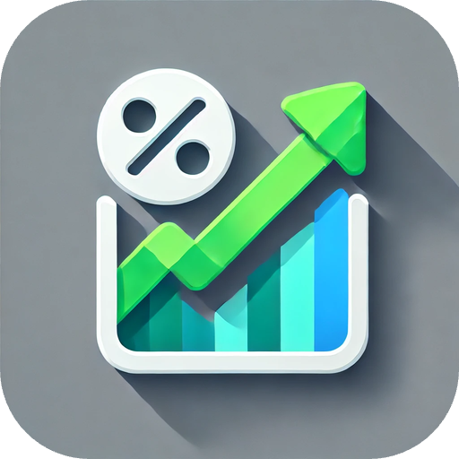
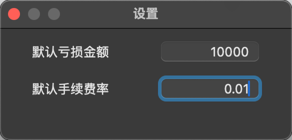
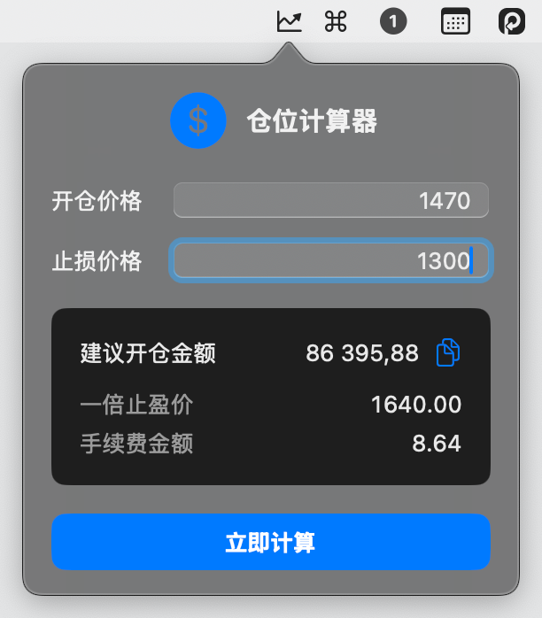

<div align = "center">

<h1>仓位计算器（PositonCalculator）</h1>
</div>


## 项目概述

仓位计算器是一款macOS菜单栏应用程序，专为交易者设计，用于快速计算合适的仓位大小，确保风险管理策略的执行。通过输入开仓价格和止损价格，应用程序能够计算出适当的投资金额，帮助交易者控制风险。

## 功能特点

- **简洁的菜单栏界面**：应用程序位于macOS的顶部菜单栏，随时可用
- **精确的仓位计算**：基于开仓价格、止损价格和预设亏损金额计算理想仓位
- **考虑交易手续费**：计算结果包含交易手续费的影响
- **自动计算止盈价格**：基于对称原则自动计算潜在止盈价格
- **可自定义设置**：允许用户设置默认亏损金额和手续费率
- **登录时自动启动**：可选择在系统启动时自动运行应用程序

## 安装方法

1. 下载最新的安装包 (.dmg 文件)
2. 打开下载的 .dmg 文件
3. 将应用程序拖拽到"应用程序"文件夹
4. 首次运行时，从"应用程序"文件夹中右键点击应用程序，选择"打开"
5. 确认打开应用程序

### 设置选项

右键点击菜单栏图标，选择"设置"，可以配置以下选项：

1. **默认亏损金额**：设置计算时使用的默认风险金额
2. **默认手续费率**：设置交易平台的手续费率（百分比）

## 使用指南

### 基本操作

1. **启动应用**
   - 安装后首次启动程序，应用图标  将显示在顶部菜单栏
   - 计算面板会自动打开

2. **进入设置**
   - 右键点击菜单栏图标 
   - 从下拉菜单中选择"设置"选项
   - 在设置面板中，您可以：
     - 设置默认止损金额（您能接受的最大亏损）
     - 配置交易手续费率（百分比）
     - 这些参数将直接影响计算结果

3. **使用计算器**
   - 左键点击菜单栏图标  打开计算面板
   - 输入当前股票价格信息：
     - 开仓价格：您计划买入的价格
     - 止损价格：触发止损的价格
   - 按下键盘 Enter 键或点击"立即计算"按钮获取结果

4. **查看计算结果**
   - 计算完成后，您将看到：
     - 建议投资金额
     - 预计目标盈利价格
     - 其他相关数据
   - 根据这些信息，您可以制定精确的投资计划，控制风险

## 示例
假设茅台当前股价为1470元/股，您看好其后市表现并计划建仓。作为理性投资者，您预先设定风险控制条件：
止损价位：1300元/股
可承受最大亏损：10000元
使用仓位计算器后，得出最优投资金额为86,395.88元。这意味着：
以1470元/股买入约58.77股（实际可买入58股）
当股价下跌至1300元/股时触发止损
实际亏损约为9,860元，符合您的风险承受能力
通过这种方式，您可以在把握投资机会的同时，精确控制可能的损失，实现理性投资。

1、设置止损金额和手续费率，所有设置更改会立即生效，无需重启应用程序。
<p>
   
</p>
2、输入开仓价格和止损价格，获取计算结果。
<p>
   
</p>


## 计算逻辑

仓位计算器使用以下公式计算建议的投资金额：

```
投资金额 = (亏损金额 × 入场价格) ÷ (|入场价格 - 止损价格| + 手续费率 × 入场价格)
```

其中：
- 亏损金额：预设的可接受亏损金额
- 入场价格：计划的开仓价格
- 止损价格：计划的止损价格
- 手续费率：交易平台的手续费率（以小数表示）

止盈价格计算基于对称原则：
```
止盈价格 = 2 × 入场价格 - 止损价格
```

## 系统要求

### 使用要求
- macOS 11.0 (Big Sur) 或更高版本
- 约10MB的磁盘空间

### 开发要求
- Xcode 14.0 或更高版本
- Swift 5.5 或更高版本
- macOS 11.0 SDK 或更高版本

## 开发环境兼容性

本项目已在以下环境中测试通过：

| 开发工具 | 版本 |
|---------|------|
| Xcode   | 14.3, 15.0 |
| Swift   | 5.5, 5.7, 5.9 |
| macOS   | 11.0 (Big Sur), 12.0 (Monterey), 13.0 (Ventura), 14.0 (Sonoma) |

## 隐私与数据

仓位计算器完全在本地运行，不收集或传输任何用户数据。所有计算和设置都存储在您的设备上，并且只在应用程序运行期间使用。

## 反馈与支持

如有问题或建议，请通过以下方式联系：

- 电子邮件：[lishiquann@gmail.com](mailto:lishiquann@gmail.com)
- GitHub：[提交Issue](https://github.com/bandili/PositionCalculator/issues)